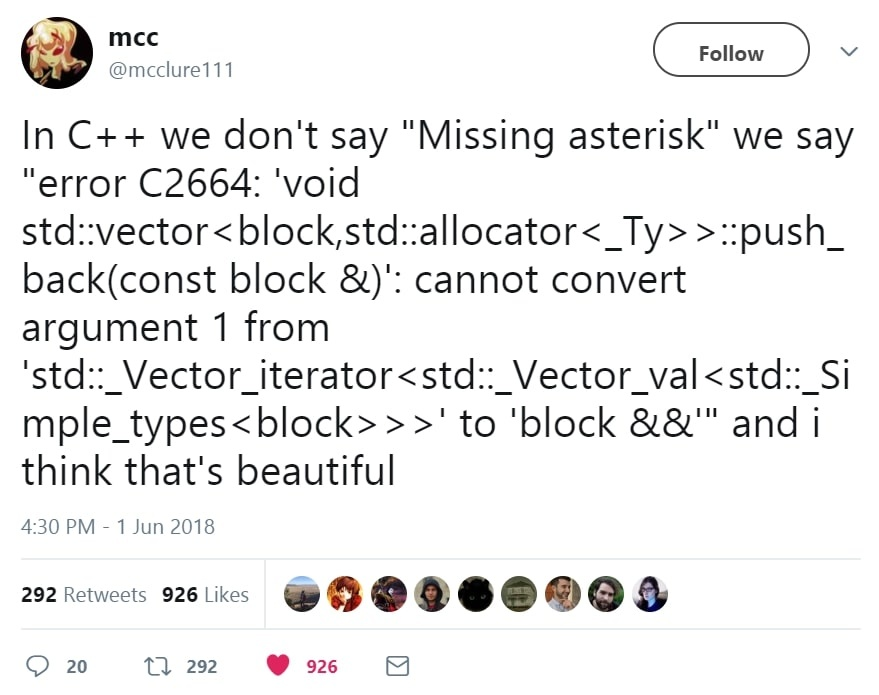

C++ basics
==========

### Quick history

{width=20%}

- Created by **Bjarne Stroustrup** in the 80s, first standard in **1998**
- C++ is a compiled object-oriented and multi-paradigm programming language
- Strong distinction between "old" C++ (pre C++11) and **modern** C++

### "I like C++" and other hilarious jokes you can tell yourself

{width=50%}

### What's a compiler? Can I eat it?

A *compiler* is a software which goal is to generate **lower-level**
intermediate code or machine code from **higher-level** source code.

- `gcc` generates *assembly* from *C*
- `ocamlc` generates *OCaml bytecode* from *OCaml*
- `rustc` generates *llvm-ir* from *Rust*

C++ is most often compiled by `g++` or `clang++` (or `msvc` on Windows).

\pause
\vfill

#### Why such errors?

C++ is a complex language which compiles through code generation.
Errors often happen deep within generated code, hence the awfully long errors.

### Hello world!

```cpp
#include <iostream>

int main()
{
    std::cout << "Hello there" << std::endl;
    return 0;
}
```
\vfill
#### Compile and run

```
42sh$ g++ -Wall -Wextra -pedantic -std=c++20 hello.cc -o hello
42sh$ ./hello
Hello there
```

### Generics and polymorphism

A *generic* function is a function which can take multiple types as arguments.

\pause

This is linked to **polymorphism**: representing multiple types with a
common symbol.

Polymorphism can be:

- **static**, *i.e.* processed at compile-time
- **dynamic**, *i.e.* processed at run-time

\pause

In C++, either **subtyping** (static and dynamic) or **templates** (static
only).

### Subtyping classes

- In object-oriented programming, one can create a **subclass** which *inherits*
  from another class.
- This is a form of **subtyping**.

\vfill
This subclass can be used in any context where the superclass is expected, but
not the reverse.

\vfill
#### Example
See `code/cpp-basics/subtypes.cc`

### Static type, dynamic type

Depending on the context, an object can have multiple types:

- A **static type**, its type at compile-time within a specific context
- A **dynamic type**, the type with which it is created which can be accessed at
  run-time.

\pause

The dynamic type of an object can be accessed through **virtual methods**.

\vfill
#### Example
See `code/cpp-basics/static-vs-dynamic.cc`

### Templates and monomorphization

- The other type of genericity allowed by C++ is **templates**.
- Templates allow for any class or function to be parametrized by a specific type.
- This will then generate appropriate code through a process known as
  *monomorphization*.

Templates are **fully static**, they are processed at compile-time only and do
not exist at run-time.

\vfill

#### Quick note
Templates are the main mechanism causing the awful error messages of C++.
1091 lines of error for a one-line function? Thank templates.

### Template instantiation

```cpp
template <typename T>
void f() // f is parametrized by any type T
{}

int main()
{
    f<int>();   // generate a function specialized for int
    f<float>(); // generate a function specialized for float

    return 0;
}
```

### C++20 `auto` syntax

In C++20, one can write the following:
```cpp
template <typename T>
void print(T v) { std::cout << v; }
```

as such:

```cpp
void print(auto v) { std::cout << v; }
```

- This is only *syntactic sugar*, those two writings are exactly the same!
- The `auto` syntax is monomorphized too!

### To keep in mind

- Objects have a **static** type and a **dynamic type** which may differ
- Templates are only processed at **compile-time**
- Templates **generate** specialized code for every possible template parameter
