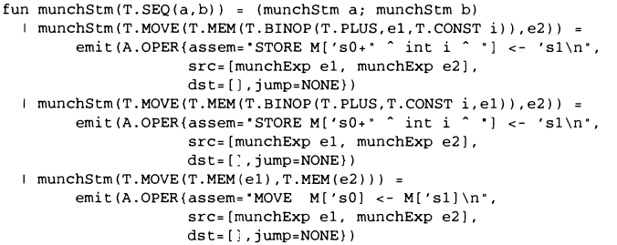

Hacking C++ (badly) to emulate OCaml (poorly)
=============================================

### Down the rabbit hole

The previous example was neat, but it had no destructuring.

\pause
{height=40%}

\pause
The whole instruction selection process is based on this...

### Back to MonoBURG

Since 2005, instruction selection was done using
[MonoBURG](https://gitlab.lrde.epita.fr/tiger/monoburg) which generates nested
C++ switches from input files.

```cpp
binop: Binop(left : exp, right : Const)
{
    rBinop binop = tree.cast<Binop> ();
    rConst cst = right.cast<Const> ();

    // ...
}

binop: Binop(left : exp, right : exp)
{
    // ...
}
```

### From nested switches...

The previous code would generate something like that (way less readable though):

```cpp
switch(tree->type) {
case Tree::BINOP:
    auto binop = tree.cast<Binop>();
    switch(binop->right->type) {
    case Tree::CONST:
        auto cst = right.cast<Const>();
        // ...
    }
// ...
}
```

To make this work, each node had a tag to specify its dynamic type. \pause We
can do better.

### ...to nested visits

If we can nest switches, why not nest visits?

```cpp
void GasMatcher::operator()(tree::rBinop binop)
{
    auto left = binop->left_get()->variant(binop->left_get());
    auto right = binop->right_get()->variant(binop->right_get());

    tree::ExpVariant::visit(
        misc::LambdaVisitor{
            [&](auto lhs, tree::rConst cst) { /* ... */ },
            [&](auto lhs, auto rhs) { /* ... */ },
        },
        left, right);
}
```

This is a bit better, but still kind of whack...

### Not so trivial

- Our "pattern-matching" is a visitor dispatching on specific types
- Dispatch is only based on the **static type** stored in the variant
- How do we dispatch based on the type of a node's children if we can only
  dispatch on the node's static type?

In other words, how can the static type of a node depend on the type of its
children?

### A hint of an answer

- What's the type of...
\pause
    - `int`
\pause
    - `std::string`
\pause
    - `std::vector<int>`
\pause
    - `std::vector<std::string>`
\pause
    - `std::tuple<int, std::string>`
\pause
    - `std::tuple<std::string>`
\pause
\vfill

- Which of these denote the same type? \pause Obviously, *none*.
\vfill

\pause
**Monomorphization** applies to types too!

Templated types denote **multiple types** that can be **generated** at run-time
through template instantiation.

### TODO

- If we template nodes based on the children's type, we create specified types!
- We could then do specific matching functions for specific types and subtypes!

Seems simple! Here's what we have to do:

1. Template the nodes with children
\pause
2. Template the smart pointer wrapping the node
\pause
3. Template the variant wrapping the smart pointer
\pause
4. Specify the templates type at definition
\pause
5. Cry over the sheer number of templates everywhere

### We're in too deep

You should be asking yourselves some questions:

- Are we doing things right?
\pause
- Do we really have to template everything?
\pause
- Do we really have to explicitly state all types?
\pause
- Can't we just go back to OCaml?
\pause
- Why are we here just to suffer?

### One word: Class Template Argument Deduction

- Did you notice the `auto` keyword I use everywhere?
- This is used for type inference \pause (like in OCaml but less good)
\pause
- What if we were able to use `auto` as a template parameter?

\pause
Well, unfortunately we can't. Instead we have **template argument deduction**:
since C++17, if we **omit** the template arguments in certain contexts (like
definitions) they can be **inferred**.

But they can't be used everywhere... \pause So we make templated factory
functions which can deduce what can't be deduced at construction.

### Using the dynamic type in variants

What if a node's static type differs from it's dynamic type?

```cpp
using vTree = std::variant<sInt, sMem>;
sTree t = make_mem(sInt(new Int(42)));
vTree v = t; // Will not compile: sTree is not in vTree
```

When declaring the variant, only the value's static type is taken into account,
but we want to access the dynamic type.

To access the dynamic type, either we force the cast (which would cause an error
if we cast to the wrong type) or we use virtual methods.

### Smarter pointers

- Shared pointers are used throughout the program for memory management
- They are garbage collected using **reference counting**
- Each shared pointer points to a dynamically allocated resource and contains a
  counter to the number of shared pointers referencing it

\vfill
\pause
```cpp
A* raw_a = new A;
std::shared_ptr<A> ptr1(raw_A); // use_count = 1
std::shared_ptr<A> ptr2(ptr1);  // use_count = 2
```

\vfill
\pause
- When `ptr1` or `ptr2` goes out of scope, `use_count` is decremented.
- If it goes to 0, the resource is deallocated.

### Not so smart

The use count is actually propagated only through copy construction.

\vfill
\pause
What happens here?

```cpp
A* raw_a = new A;
std::shared_ptr<A> ptr1(raw_A); // ptr1's use_count = 1
std::shared_ptr<A> ptr2(raw_A); // ptr2's use_count = 1
```

\vfill
\pause
- `ptr1` and `ptr2`'s use count are distinct here...
- If one goes out of scope the resource will be deallocated, and when the second
  one attempts to free it we get an error.

### C++ black magic

- Thanks to `std::enable_shared_from_this` we can fix this issue
- Using the provided `shared_from_this` method returns a smart pointer with the
  correct reference count, which can then be propagated through copy
  construction

\vfill
\pause
#### Note

For some reason this does not work properly in TC, probably due to our wrapper
class on `std::shared_ptr`, so we pass the shared pointer as argument to the
virtual method...

```cpp
auto left = binop->left_get()->variant(binop->left_get());
```

### Monomorphization does not suppress warnings...

Let's imagine we have some code like that:

```cpp
int main()
{
    std::variant<int, float, double, std::string> v1 = 0;
    std::variant<int, float, double, std::string> v2 = "zero";
    std::visit([](auto a, auto b) {
                  std::cout << "a and b are whatever\n"; },
               v1, v2);
    return 0;
}
```

\pause
We have two unused arguments, who cares right?

\pause
This **11 lines** code generates **360 lines** of unused arguments warnings.

### ...or errors

Monomorphization will generate a function every possible combination of argument
types for the lambda. Here we have two arguments which can have 4 types so 16
functions times 2 unused arguments.

\pause
Each type being an anonymous awful generated type also adds to the message's
length.

\pause
Here this is only warnings, but imagine if we had template errors inside of the
lambda...

\vfill
\pause
#### An exercise in absurdity
See `code/cpp-matching-hacks/minmax.cc`

### Subtyping gets rid of templates!

- We can upcast shared pointers on `Tree` subclasses to shared pointers to
  `Tree`
- This means we can remove the `auto` for default cases!
- Without `auto`, no more monomorphization and way shorter error messages

\vfill
#### Example
See `code/cpp-matching-hacks/match-tree-upcast.cc`

\pause
#### ...but not in TC
This does not work in TC due to our wrapper class on `std::shared_ptr`.


\pause
This is due to poor template instantiation which can be fixed using C++20
concepts (a mechanism for adding constraints to templates).

### Aren't we missing something?

If you paid attention, the last examples did not feature any destructuring.

\pause
- Implementing it features templates heavily, which does complicates everything.
\pause
- And our `Tree` implementation in TC is not templated...

\pause
This is bad news.

### Let's rephrase

- Templates are fully static, so compile-time only
- Dynamic types are, well, dynamic, so run-time only

How can we generate at compile-time types which are only known at run-time?

\vfill

Three ideas:

\pause

1. Scrap it and template the whole tree class

\pause

2. Statically handle every possible case

\pause

3. Get type tags from virtual methods and use it as template parameter

### The template hell

- Templates add a lot of complexity to the code you write
- Keep in mind the tree structure is an intermediate representation generated
  from an AST, so the problem is the same
- How can we even handle every possible tree structure at compilation anyway?

\pause
Imagine this templated type (and associated tree):

```
Mem<Mem<Mem<Mem<Mem<Mem<Move<Int, Move<Int, Mem<Mem<...>>>>>>>>>>
```

The **static** type would have to contain the content of the whole **dynamic**
tree... This makes no sense.

\pause
#### Note
We could think about using tags and end up with `Mem<mem_t>` to restrict the
depth of the template, it might be possible to have it working but would still
involve a lot of complexity.

### There can't be that many cases, right?

Handling statically every possible dynamic case might be possible.

::: {.block}
#### Example
See `code/...`
:::

\pause
- We end with nested visits to generate templated types...
\pause
- Why not just perform nested visits then?

\pause
This is a working solution, but adds too much unnecessary complexity.

### Dynamic and static don't match

\pause
```cpp
template <int N> struct S {};
int main(int argc, char *argv[])
{
    S<1000> s1;
    S<argc> s2;
}
```
\pause
Templates are **compile-time** only. What's the value of `argc` at compilation?

\pause
- This will not compile because every template parameter must be known at
  compilation
- Virtual method calls are run-time only

We can't use virtual methods results for templating.

### Wasted

What we try to do here can't work.

\pause

- We can't mix dynamic and static polymorphism at will, by definition it's not
  the way they work.
\pause
- Generating templated types from types unknown at compilation this way, the
  basis of our pattern-matching destructuration, is not possible.
\pause

We'll have to stick to more basic matching, but that's okay: C++ is just not the
language for the job.
