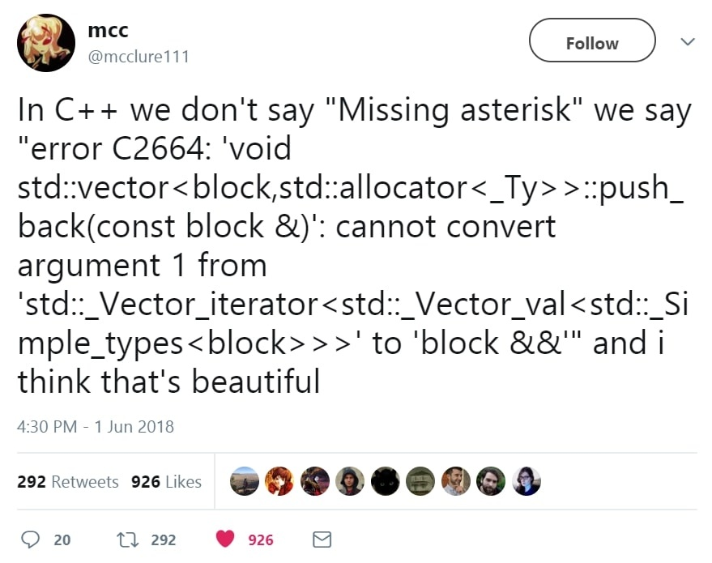

---
title: "How to do bad pattern-matching in C++"
subtitle: "and generate 917 lines of warnings per line of code"
author: "Mael Cravero"
institute: "EPITA - Tiger Compiler"
topic: "Tiger Compiler"
linkstyle: bold
aspectratio: 169
date: December 2021
section-titles: true
toc: false
...

Introduction
============

### Hey Vsauce

- Mael Cravero
- ACDC, YAKA, ACU
- Tiger Maintainer
- Strong interest in **static analysis**, **compilation** and **programming
  languages** in general

\vfill
\pause

#### Warning

We will talk about OCaml.
\pause
I like OCaml.

### A bit of context

- About a year ago, I was working on Tiger Compiler a lot
- TC's instruction selector was **old** (last meaningful modification was 2005)
- **Modern C++** is way different from 2005 C++

How can this section of the project be modernized?

### Instruction selection in a nutshell

{height=100%}

### The main idea

- Instruction selection is basically **pattern-matching**...
\pause
- ...but there is no pattern-matching in C++...
\pause
- ...so we used an external program (MonoBURG) to generate nested switches

\vfill
\pause

#### Goal

**Replace** non-idiomatic pattern-matching generated by MonoBURG with
**idiomatic** modern C++ using `std::visit` and `std::variant`.


### Goals of this presentation

1. C++ and compilation basics
\pause
2. Pattern-matching concepts
\pause
3. Emulate basic pattern-matching in C++
\pause
4. Static vs dynamic polymorphism
\pause
5. Try to do smart things and fail miserably

C++ basics
==========

### Quick history

{width=20%}

- Created by **Bjarne Stroustrup** in the 80s, first standard in **1998**
- C++ is a compiled multi-paradigm programming language with "0-cost
  abstractions"
- First started as an "object-oriented C", now a somewhat high-level language
  with many (*many*) features
- Strong distinction between "old" C++ (pre C++11) and **modern** C++

### "I like C++" and other hilarious jokes you can tell yourself

{width=50%}

### What's a compiler? Can I eat it?

To put it simply, a *compiler* is a software which goal is to generate
**lower-level** intermediate code or machine code from **higher-level** source
code.

- `gcc` generates *assembly* from *C*
- `ocamlc` generates *OCaml bytecode* from *OCaml*
- `rustc` generates *llvm-ir* from *Rust*

C++ is most often compiled by `g++` or `clang++` (or `msvc` on Windows).

\pause
\vfill

#### Why such errors?

C++ is a complex language which compiles through code generation.
Errors often happen deep within generated code, hence the awfully long errors.

### Hello world!

```cpp
#include <iostream>

int main()
{
    std::cout << "Hello there" << std::endl;
    return 0;
}
```
\vfill
#### Compile and run

```
42sh$ g++ -Wall -Wextra -pedantic -std=c++20 hello.cc -o hello
42sh$ ./hello
Hello there
```

### Generics and polymorphism

A *generic* function is a function which can take multiple types as arguments.

\pause

This concept is linked to **polymorphism**: representing multiple types with a
common symbol.

Polymorphism can be:

- **static**, *i.e.* processed at compile-time
- **dynamic**, *i.e.* processed at run-time

\pause

In C++, genericity can be expressed mostly through **subtyping**, which is
linked to static and dynamic polymorphism, and **templates**, which are only
linked to static polymorphism.

### Subtyping classes

In object-oriented programming, one can create a **subclass** which *inherits* from
another class. This is a form of **subtyping**.

This subclass can be used in any context where the superclass is expected, but
not the reverse.

\vfill
#### Example
See `code/cpp-basics/subtypes.cc`

### Static type, dynamic type

Depending on the context, an object can have multiple types. We differentiate
its **static type**, its type at compile-time within a specific context, from
its **dynamic type**, the type with which it is created which can be accessed at
run-time.

\pause

The dynamic type of an object can be accessed through **virtual methods**. This
is the basis of patterns like visitors (which we won't talk about).

\vfill
#### Example
See `code/cpp-basics/static-vs-dynamic.cc`

### Templates and monomorphization

The other type of genericity allowed by C++ is **templates**.

Templates allow for any class or function to be parametrized by a specific type.
This will then generate appropriate code through a process known as
*monomorphization*.

Templates are **fully static**, they are processed at compile-time only and do
not exist at run-time.

\vfill

#### Quick note
Templates are the main mechanism causing the awful error messages of C++.
1091 lines of error for a one-line function? Thank templates.

### Template instantiation

```cpp
template <typename T>
void f() // f is parametrized by any type T
{}

int main()
{
    f<int>();   // generate a function specialized for int
    f<float>(); // generate a function specialized for float

    return 0;
}
```

### C++20 `auto` syntax

In C++20, one can write the following:
```cpp
template <typename T>
void print(T v) { std::cout << v; }
```

as such:

```cpp
void print(auto v) { std::cout << v; }
```

This is only *syntactic sugar*, those two writings are exactly the same! The
`auto` syntax is monomorphized too!


Pattern-matching for dummies
============================

### OCaml > all

{width=20%}

\pause

- **OCaml** is the best language taught in EPITA
\pause
- Fight me
\pause

One particularly nice feature: its **pattern-matching** system.

### Don't trust me?

{width=80%}

### Basic matching

```ocaml
let is_the_answer n =
  match n with
  | 42 -> "The answer"
  | _ -> "Not the answer"
;;

let () = print_endline (is_the_answer 42)
```

### Algebraic types

Algebraic types are **composite types** common in functional programming. There
are two main types:

- **product types**: type $\alpha$ *and* type $\beta$ *and*...
- **sum type**: type $\alpha$ *or* type $\beta$ *or*...

\pause

In more common terms, a tuple-like type or a union-like type.

### An example

```ocaml
type a_or_b = A | B

let string_of_a_or_b x =
  match x with
  | A -> "A"
  | B -> "B"
;;

let () = print_endline (string_of_a_or_b A) (* "A" *)
```

### It gets better

```ocaml
type a_or_b = A | B of int

let string_of_a_or_b x =
  match x with
  | A -> "A"
  | B n when n = 42 -> "The answer"
  | B _ -> "B"
;;

let () = print_endline (string_of_a_or_b (B 21)) (* "B" *)
```

### The killer feature

OCaml pattern-matching is **very expressive**, thanks to:

- **wildcard** patterns
\pause
- **guards** to check specific conditions
\pause
- **destructuration** to match on inner fields

\pause
\vfill
#### Compiler safety
Thanks to exhaustiveness checks, you cannot write a `match` with unusable or
missing cases. This greatly reduces the number of errors you could write.

### Back to our problem

Let's put it all in practice!

```ocaml
type tree = Int of int | Mem of tree | Move of tree * tree
let rec traverse = function ...
let matcher = function ...
```

\pause
Last OCaml example, I swear.

\vfill
#### Example

See `code/pattern-matching/match-tree.ml`

Back to C++
===========

### Switches save the day!

```cpp
#include <iostream>

int main()
{
    int n = 42;
    switch (n)
    {
    case 42:
        std::cout << "The answer" << std::endl;
        break;
    default:
        std::cout << "Not the answer" << std::endl;
    }
    return 0;
}
```

### Well, only if processing primitive types...

```cpp
#include <iostream>

int main() {
    std::string s = "Hello there...";
    switch (s) {
    case "Hello there...":
        std::cout << "General Kenobi" << std::endl;
    default:
        break;
    }
    return 0;
}
```

\pause
This **does not** compile. `error: switch quantity not an integer`

### Remember algebraic types?

Algebraic types exist in C++ since **C++11** for product types (`std::tuple`)
and **C++17** for sum types (`std::variant`).

\pause
\vfill

```cpp
#include <string>
#include <tuple>
#include <variant>

int main()
{
    std::tuple<int, std::string> p = {0, "zero"};
    std::variant<int, std::string> s_int = 42;
    std::variant<int, std::string> s_string = "forty-two";
    return std::get<int>(s_int);
}
```

### Static or dynamic?

What happens there?

```cpp
#include <string>
#include <variant>

int main()
{
    std::variant<int, std::string> s = "forty-two";
    return std::get<int>(s);
}
```

\pause
It does compile.
\pause
But we get a runtime error. `std::get: wrong index for variant`

### Naive variants using unions

Examples inspired from [cppreference/union](https://en.cppreference.com/w/cpp/language/union).

```cpp
struct my_variant
{
    enum {INT, STRING} tag;
    union
    {
        int i;
        std::string s;
    };
};
```

\pause
Obviously, `std::variant` is quite more complicated (`clang`'s `libcxx` [variant
header](https://github.com/llvm/llvm-project/blob/main/libcxx/include/variant)
is 1775 lines) but you get the idea.

### Dispatching on variants

Remember, it's all **run-time**.

```cpp
void print(const my_variant& v)
{
    switch(s.tag)
    {
        case my_variant::INT: std::cout << v.i << '\n'; break;
        case my_variant::STRING: std::cout << v.s << '\n'; break;
    }
}

int main()
{
    my_variant v = {my_variant::INT, 42};
    print(v);
}
```

### The almighty `std::visit`

For `std::variant`, we can use `std::visit`.

```cpp
#include <variant>
#include <iostream>

int main()
{
    std::variant<int, std::string> v = 42;
    std::visit([](auto x){ std::cout << x << '\n';}, v);
}
```

### Where is Waldo?

Did you catch it? A **template** was hiding in the previous slide...

\pause

Let's desugar the lambda.

```cpp
struct Lambda {
    void operator()(auto x) {
        std::cout << x << '\n';
    }
};

int main() {
    std::variant<int, std::string> v = 42;
    std::visit(Lambda(), v);
}
```

### Warning: explicit

It was there all along!

```cpp
struct Lambda {
    template <typename T>
    void operator()(T x) {
        std::cout << x << '\n';
    }
};

int main() {
    std::variant<int, std::string> v = 42;
    std::visit(Lambda(), v);
}
```

### Our first real matcher

```cpp
struct A {};
struct B {};

struct Is_A
{
    bool operator()(A) { return true; }
    bool operator()(B) { return false; }
};

int main()
{
    std::variant<A, B> v = A();
    return std::visit(Is_A(), v); // returns 1
}
```

### Default cases thanks to templates

- `std::visit` needs its visitor to handle **every possible type** for the
  variant visited
- This could get quite annoying if we had to explicitly handle every possible
  case

\pause
\vfill
```cpp
using TreeVariant = misc::variant<rExp, rStm>;
using ExpVariant =
  misc::variant<rBinop, rCall, rConst, rEseq, rMem, rName, rTemp>;
using StmVariant =
  misc::variant<rCjump, rJump, rLabel, rMove, rSeq, rSxp>;
```
\vfill
\pause

Templates can be used for this kind of generation: if we use a **templated
method** in the visitor, it will **generate code** for every otherwise unmatched
case.

\pause
This is our poor man's wildcard. \pause Sort of.

### As easy as that

```cpp
struct A {};
struct B {};

struct Is_A
{
    bool operator()(A) { return true; }
    bool operator()(auto) { return false; }
};

int main()
{
    std::variant<A, B, int, float> v = 42;
    return std::visit(Is_A(), v); // returns 0
}
```

### Basic solution

Time to put it all together!

Let's see a simple recreation of the structure we use for instruction
scheduling.

\vfill

#### Example
See `code/cpp-matching/match-tree.cc`

Hacking C++ (badly) to emulate OCaml (poorly)
=============================================

### Down the rabbit hole

The previous example was neat, but it had no destructuring.

\pause
{height=40%}

\pause
The whole instruction selection process is based on this...

### Back to MonoBURG

Since 2005, instruction selection was done using
[MonoBURG](https://gitlab.lrde.epita.fr/tiger/monoburg) which generates nested
C++ switches from input files.

```cpp
binop: Binop(left : exp, right : Const)
{
    rBinop binop = tree.cast<Binop> ();
    rConst cst = right.cast<Const> ();

    // ...
}

binop: Binop(left : exp, right : exp)
{
    // ...
}
```

### From nested switches...

The previous code would generate something like that (way less readable though):

```cpp
switch(tree->type) {
case Tree::BINOP:
    auto binop = tree.cast<Binop>();
    switch(binop->right->type) {
    case Tree::CONST:
        auto cst = right.cast<Const>();
        // ...
    }
// ...
}
```

To make this work, each node had a tag to specify its dynamic type. \pause We
can do better.

### ...to nested visits

If we can nest switches, why not nest visits?

```cpp
void GasMatcher::operator()(tree::rBinop binop)
{
    auto left = binop->left_get()->variant(binop->left_get());
    auto right = binop->right_get()->variant(binop->right_get());

    tree::ExpVariant::visit(
        misc::LambdaVisitor{
            [&](auto lhs, tree::rConst cst) { /* ... */ },
            [&](auto lhs, auto rhs) { /* ... */ },
        },
        left, right);
}
```

This is a bit better, but still kind of whack...

### Not so trivial

- Our "pattern-matching" with variants is not real pattern-matching, more of a
  visitor dispatching on specific types
- Note that the dispatch is only based on the **static type** stored in the
  variant
- How do we dispatch based on the type of a node's children if we can only
  dispatch on the node's static type?

In other words, how can the static type of a node depend on the type of its
children?

### A hint of an answer

- What's the type of...
\pause
    - `int`
\pause
    - `std::string`
\pause
    - `std::vector<int>`
\pause
    - `std::vector<std::string>`
\pause
    - `std::tuple<int, std::string>`
\pause
    - `std::tuple<std::string>`
\pause
\vfill

- Which of these denote the same type? \pause Obviously, *none*.
\vfill

\pause
**Monomorphization** applies to types too! Templated types denote **multiple
types** that can be **generated** at run-time through template instantiation.

### TODO

If we template nodes based on the children type, its type will be impacted by
the type of the children! This means that we can then do specific matching
functions for specific types and subtypes!

Seems simple! Here's what we have to do:

1. Template the nodes with children
\pause
2. Template the smart pointer wrapping the node
\pause
3. Template the variant wrapping the smart pointer
\pause
4. Specify the templates type at definition
\pause
5. Cry over the sheer number of templates everywhere

### We're in too deep

You should be asking yourselves some questions:

- Are we doing things right?
\pause
- Do we really have to template everything?
\pause
- Do we really have to explicitly state all types?
\pause
- Can't we just go back to OCaml?
\pause
- Why are we here just to suffer?

### One word: Class Template Argument Deduction

- Did you notice the `auto` keyword I use everywhere?
- This is used for type inference \pause (like in OCaml but less good)
\pause
- It can be used for variable declarations, function return type, template
  syntactic sugar...
\pause
- What if we were able to use `auto` as a template parameter?

\pause
Well, unfortunately we can't. Instead we have **template argument deduction**:
since C++17, if we **omit** the template arguments in certain contexts (like
definitions) they can be **inferred**.

But they can't be used everywhere... \pause So we make templated factory
functions which can deduce what can't be deduced at construction.

### Using the dynamic type in variants

What if a node's static type differs from it's dynamic type?

```cpp
using vTree = std::variant<sInt, sMem>;
sTree t = make_mem(sInt(new Int(42)));
vTree v = t; // Will not compile: sTree is not in vTree
```

When declaring the variant, only the value's static type is taken into account,
but we want to access the dynamic type.

To access the dynamic type, either we force the cast (which would cause an error
if we cast to the wrong type) or we use virtual methods.

### Smarter pointers

- Shared pointers are used throughout the program for memory management
- They are garbage collected using **reference counting**
- Each shared pointer points to a dynamically allocated resource and contains a
  counter to the number of shared pointers referencing it

\vfill
\pause
```cpp
A* raw_a = new A;
std::shared_ptr<A> ptr1(raw_A); // use_count = 1
std::shared_ptr<A> ptr2(ptr1);  // use_count = 2
```

\vfill
\pause
When `ptr1` or `ptr2` goes out of scope, `use_count` is decremented. If it goes
to 0, the resource is deallocated.

### Not so smart

The use count is actually propagated only through copy construction.

\vfill
\pause
What happens here?

```cpp
A* raw_a = new A;
std::shared_ptr<A> ptr1(raw_A); // ptr1's use_count = 1
std::shared_ptr<A> ptr2(raw_A); // ptr2's use_count = 1
```

\vfill
\pause
`ptr1` and `ptr2`'s use count are distinct here... If one goes out of scope the
resource will be deallocated, and when the second one attempts to free it we get
an error.

### C++ black magic

- Thanks to `std::enable_shared_from_this` we can fix this issue
- Using the provided `shared_from_this` method returns a smart pointer with the
  correct reference count, which can then be propagated through copy
  construction

\vfill
\pause
#### Note

For some reason this does not work properly in TC, probably due to our wrapper
class on `std::shared_ptr`, so we pass the shared pointer as argument to the
virtual method...

```cpp
auto left = binop->left_get()->variant(binop->left_get());
```

### Monomorphization does not suppress warnings...

Let's imagine we have some code like that:

```cpp
int main()
{
    std::variant<int, float, double, std::string> v1 = 0;
    std::variant<int, float, double, std::string> v2 = "zero";
    std::visit([](auto a, auto b) {
                  std::cout << "a and b are whatever\n"; },
               v1, v2);
    return 0;
}
```

\pause
We have two unused arguments, who cares right?

\pause
This **11 lines** code generates **360 lines** of unused arguments warnings.

### ...or errors

Monomorphization will generate a function every possible combination of argument
types for the lambda. Here we have two arguments which can have 4 types so 16
functions times 2 unused arguments.

\pause
Each type being an anonymous awful generated type also adds to the message's
length.

\pause
Here this is only warnings, but imagine if we had template errors inside of the
lambda...

\vfill
\pause
#### An exercise in absurdity
See `code/cpp-matching-hacks/minmax.cc`

### Subtyping gets rid of templates!

- We can upcast shared pointers on `Tree` subclasses to shared pointers to
  `Tree`
- This means we can remove the `auto` for default cases!
- Without `auto`, no more monomorphization and way shorter error messages

\vfill
#### Example
See `code/cpp-matching-hacks/match-tree-upcast.cc`

\pause
#### ...but not in TC
Once again, this does not work properly in TC due to our wrapper class on
`std::shared_ptr`. See `code/cpp-matching-hacks/match-tree-upcast-ref.cc`

\pause
This is actually due to poor template instantiation rules which can be fixed
using C++20 concepts (a mechanism for adding constraints to templates).

### Aren't we missing something?

- If you paid attention, the last examples did not feature any destructuring.
\pause
- This is because implementing it features templates heavily, which does complicates everything.
\pause
- Moreover, our `Tree` implementation in TC is not templated...
\pause
- This means we must either re-write everything to be templated, or have wrapper
  functions to generate templated types out of non-templated dynamic types

\pause
This is bad news.

### Let's rephrase

- Templates are fully static, so compile-time only
- Dynamic types are, well, dynamic, so run-time only

How can we generate at compile-time types which are only known at run-time?

\vfill

Three ideas:

\pause

1. Scrap it and template the whole tree class

\pause

2. Statically handle every possible case

\pause

3. Get type tags from virtual methods and use it as template parameter

### The template hell

- Templates add a lot of complexity to the code you write
- Keep in mind the tree structure is an intermediate representation generated
  from an AST, so the problem is the same
- How can we even handle every possible tree structure at compilation anyway?

\pause
Imagine this templated type (and associated tree):

```
Mem<Mem<Mem<Mem<Mem<Mem<Move<Int, Move<Int<Mem<...>>>>>>>>>>
```

The **static** type would have to contain the content of the whole **dynamic**
tree... This makes no sense.

\pause
#### Note
We could think about using tags and end up with `Mem<mem_t>` to restrict the
depth of the template, it would be possible to have it working but would still
involve a lot of complexity.

### There can't be that many cases, right?

Handling statically every possible dynamic case might be possible.

::: {.block}
#### Example
See `code/...`
:::

\pause

We end with nested visits to generate templated types... Why not just perform
nested visits then?

This is a working solution, but adds too much unnecessary complexity.

### Dynamic and static don't match

::: {.block}
#### Example
See `code/...`
:::

\pause
```cpp
template <int N> struct S {};
int main(int argc, char **argv)
{
    S<1000> s1;
    S<argc> s2;
}
```
\pause
Templates are **compile-time** only. What's the value of `argc` at compilation?

\pause
This will not compile because every template parameter must be known at
compilation, which is not the case of `argc`. This is why we can't use virtual
methods results for templating.

### Wasted

What we try to do here can't work.

\pause

- We can't mix dynamic and static polymorphism at will, by definition it's not
  the way they work.
\pause
- Generating templated types from types unknown at compilation this way, the
  basis of our pattern-matching destructuration, is not possible.
\pause

We'll have to stick to more basic matching, but that's okay: C++ is just not the
language for the job.

Conclusion
==========

### What about TC?

- The chosen solution for TC's instruction selection is nested visits
- This is bad, but is it worse than MonoBURG? We do have one less dependance on
  an obscure program and learn useful C++ concepts
- Another section of the project uses `std::visit` too (without nested visits)
  and it is very clean

\pause
And since TC's goal is to learn C++... Is this bad solution really that bad?

Learning about the limits of a language is in my opinion as important as
learning what it's good at, and we're certainly reaching the limits there.

### Libraries are, in fact, a thing

- There are smarter and more skilled C++ developers than me
- We want to avoid external libraries in TC to learn standard "vanilla" C++, but
in real life libraries are what we would use
\pause
- One of the most well known is Michael Park's **Patterns** library which looks
like this:

```cpp
int fact(int n) {
  using namespace mpark::patterns;
  return match(n)(pattern(0) = [] { return 1; },
                  pattern(arg) = [](auto n) { return n * fact(n - 1); });
}
```

\pause
#### Check it out
- [https://github.com/mpark/patterns](https://github.com/mpark/patterns)
- On YouTube, [CppCon 2019: Michael Park “Pattern Matching: A Sneak
  Peek”](https://www.youtube.com/watch?v=PBZBG4nZXhk)

### One day maybe?

- This library has evolved to a feature proposition for C++23
- The last proposal is [P1371](http://www.open-std.org/jtc1/sc22/wg21/docs/papers/2020/p1371r3.pdf) which introduces nice concepts
- There has been a few attempts to add pattern-matching in C++17 and C++20, it
will most probably be added to the language at some point

\pause
So who knows, maybe one day we'll have what we need in C++...

\pause
In the meantime, I'll be writing OCaml!
